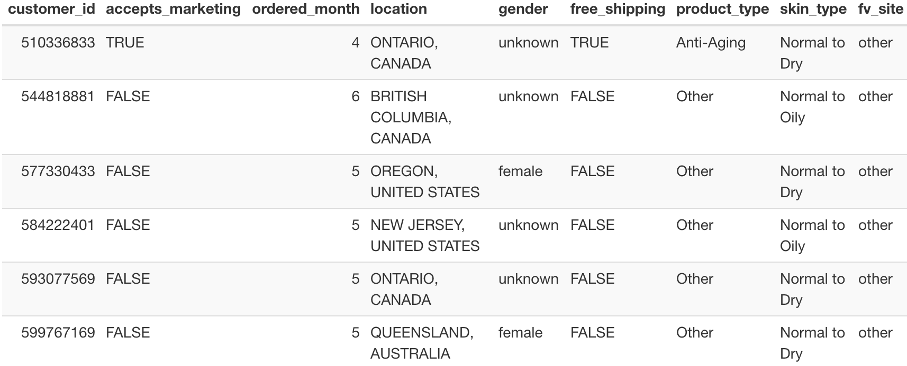
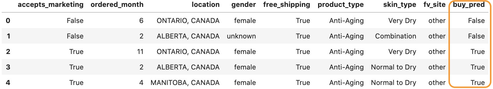

# Classification Modeling for Riversol

We built a classification model to predict whether or not a sample taker will become a paying customer. 

*After running the following step by step, you will get an extra column called "buy_pred" that contains True/False prediction based on the 8 features. 

# Usage
#### Prerequisite
Before step 1, you should have postgressql installed.\
Please check [HERE](https://www.postgresql.org/download/) for downloading or run `brew install postgresql` in the terminal if you are on a Mac with homebrew.

#### Step 1. After cloning this GitHub repository, install the dependencies by copying and running the following command at the command line/terminal from the model-2-classification directory of this project.

```
pip install -r requirements.txt
```


#### Step 2. Get clean data(cleaned_df.csv) from the SQL database, enter the following one line (with 5 arguments).
    
```
python src/data/data_cleaning.py --dbname=<dbname> --user=<user> --password=<password> --host=<host> --out_dir=<out_dir>
```
- dbname: database name
- user: user name
- password: password for the user
- host: IP address
- out_dir: path to the file that the clean data is going to be saved

*Suggested Example(you can directly copy and run the following):*

```
python src/data/data_cleaning.py --dbname=riversol_TEST_DB --user=postgres --password=7J4xKoYnVFGjDKe3GqKP --host=54.185.202.161 --out_dir=data/processed
```


#### Step 3. Train the model with the clean data by running the following one line (with 2 arguments).

```
python src/models/clf_model.py --input=<input> --out_dir=<out_dir>
```
- input: path to the file where the clean data(cleaned_df.csv) is saved
- out_dir: path to the file where the training, validation and test data will be saved

*Suggested Example(you can directly copy and run the following):*

```
python src/models/clf_model.py --input=data/processed/cleaned_df.csv --out_dir=data/processed
```

#### Step 4(optional). Get the result of model performance by running the following one line (with 2 arguments).
```
python src/models/result.py --input=<input> --out_dir=<out_dir>
```
- input: path to the file where the validation/test data(valid_df.csv/test_df.csv) is saved
- out_dir: path to the file where the model report table(model_report.csv)will be saved

*Suggested Example(you can directly copy and run the following):*
```
python src/models/result.py --input=data/processed/valid_df.csv --out_dir=reports
```


#### Step 5. Prediction on new data, enter the following one line(with 2 arguments).
```
python src/models/predict.py --input=<input> --out_dir=<out_dir>
```
- input: path(including filename) to the sample takers dataframe to be predicted
- out_dir: path to the file where dataframe with prediction column will be saved

*IMPORTANT: Data input must include these 8 columns:*

|Column|Description|
|---|---|
|`accepts_marketing`|Whether the customer accepts marketing eamils (accepted value: True/False)|
|`ordered_month`|The month when the sample taker took the sample (accepted values: 1-12)|
|`location`|Customer location (accepted format: eg. "ALBERTA, CANADA", "BRITHSH COLUMBIA, CANADA")|
|`gender`|Customer gender(suggested values: "unknown", "female", "male")|
|`free_shipping`|Whether the customer paid anything for the sample (accepted values: True/False)|
|`product_type`|The type of the sample (accepted values: "Anti-Aging", "Redness", "Other")|
|`Skin_type`|Customer's skin type (accepted values: "Normal to Dry", "Normal to Oily", "Very Dry", "Dry", "Combination", "Very Oily", "Oily", "Unknown")|
|`fv_site`|Customer first visit through (accepted values: "redditad", "pinterest", "Messenger_Stories", "Instagram_Stories", "Instagram_Feed", "Instagram_Explore", "influencer","googleshopping", "Facebook_Mobile_Feed", "facebook_messenger", "Facebook_Marketplace", "Facebook_Instant_Articles", "facebook_IG_plus","Facebook_Desktop_Feed", "cbcarticle", "Bingros", 'bing', "6168286054243", "6166380916443", "6121570192043", "6104146934443", "6104145954643")|


*Suggested format of data input should be like the following*


*Example with a toy dataset `sampletaker_df`:*
```
python src/models/predict.py --input=data/raw/sampletaker_df.csv --out_dir=data/processed
```
After running the prediction, you will get a "buy_pred" column looks like (circled in orange):


# Classification and Exploratory Model report
- The model report and findings are rendered in HTML format, and is located here: [LINK](./reports/final_exploratory_report.html).
- You can directly review the content through this [LINK](./reports/Final_Exploratory_Analysis_Classification_Report.pdf). This PDF is generated from the HTML report for a quick review purpose, not everything is rendered properly.

# Exploratory Feature Plots Usage
```
python src/features/explore_features_and_shap.py --input=<input> --out_dir=<out_dir>
```
- input: path to the file where the clean data(cleaned_df.csv) is saved
- out_dir: path to the file where the feature plots will be saved

*Suggested Example(you can directly copy and run the following):*
```
python src/features/explore_features_and_shap.py --input=data/processed/cleaned_df.csv --out_dir=reports/figures/
```


