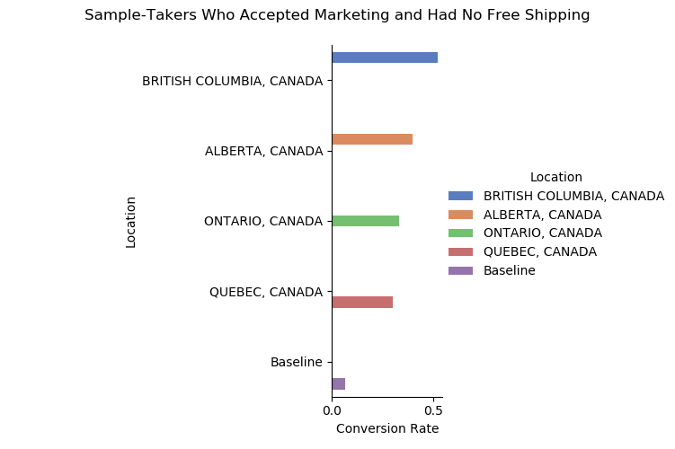
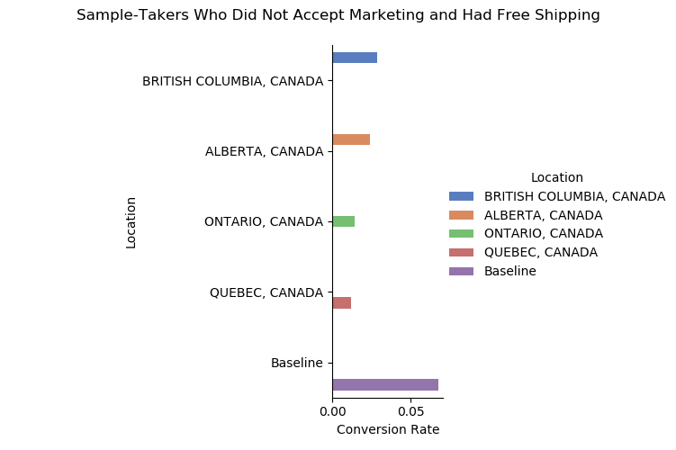
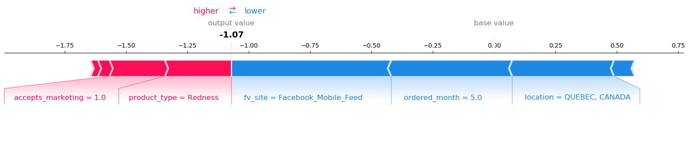
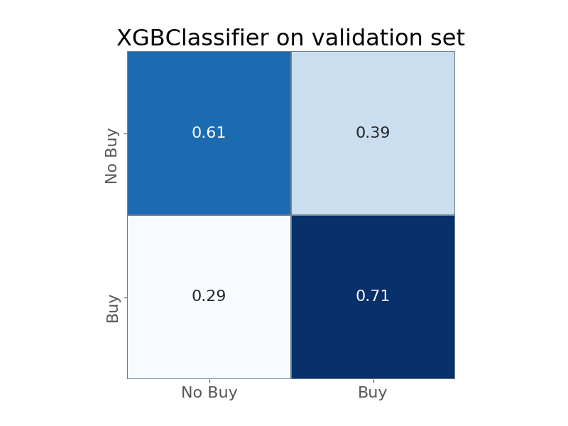

```{r global_options, include=FALSE}
knitr::opts_chunk$set(fig.pos = 'H')
```

```{r setup, include=FALSE}
knitr::opts_chunk$set(echo = FALSE)
library(tidyverse)
library(infer)
library(ggpubr)
library(rstatix)
library(dplyr)
library(float)
library(scales)
library(formattable)
library(kableExtra)
```
This report is based on removing all sample-takers that did not convert into paying customers in the most recent 46 days of data. This is because there exists a time period between the time sample-takers take the sample and make their first purchase, so our model would be inaccurate if we evaluated whether or not a sample-taker would purchase without giving them a reasonable time period to try the sample and make a purchase. We selected 46 days because that is how long it takes for sample-takers to become paying customers on average.

After this, our data consisted of 593,404 sample-takers.

# Data overview
```{r}

df <- read_csv("../data/processed/cleaned_df.csv", col_types = cols())
df <- df %>% 
    filter(days_from_sample >46)
df <- df[-c(4, 5)]

kable(head(df)) %>%
  kable_styling(bootstrap_options = c("striped", "hover", "condensed"))


```

# Exploratory Feature Analysis
### Which features are important/contribute the most to whether or not a sample-taker will buy?
- Null hypothesis(H0): There is no difference in proportion of buyers(returned customers).\
- Alternative hypothesis(Ha): There is a significant difference in proportion of buyers(returned customers).

```{r}
feature_vec <- as.vector(colnames(df))
drop_elements = c('customer_id', 'buy', 'ordered_year', 'days_from_sample')
feature_vec <- feature_vec[!(feature_vec %in% drop_elements)]
```

```{r}
ggplot(df, aes(x=buy)) +
    geom_bar(aes(fill = factor(..x.., labels=c("FALSE","TRUE"))), stat="count")+
    geom_text(aes(label=stat(count), y= ..prop..),stat='count', vjust = -.5)+
    geom_text(aes(label = scales::percent(prop.table(stat(count))),
                   y= ..count.. ), stat= "count", vjust = 0) +
     scale_y_continuous(labels = comma) +
     labs(x= "If sample-takers come back and buy", y = "Count", fill="Buy")+
     ggtitle("Baseline Conversion Rate For Sample-Takers")

y_lower <- sum(df$buy == TRUE)/nrow(df)
y_upper <- 1-y_lower

```


### 1. accepts_marketing vs buy

```{r, fig.width = 6, fig.height=6}

theme_update(plot.title = element_text(hjust = 0.5))
ggplot(df, aes(x= buy,  group=accepts_marketing)) + 
    geom_bar(aes(y = ..prop.., fill = factor(..x.., labels=c("FALSE","TRUE"))), stat="count") +
    geom_text(aes(label=stat(count), y= ..prop..),stat='count', vjust = 1.5)+
    geom_text(aes(label = scales::percent(..prop..), y= ..prop.. ), stat= "count", vjust = -.5) +
    labs(x= "If sample-takers come back and buy", y = "Percentage", fill="Buy") +
    facet_grid(~ifelse(accepts_marketing, "Accept marketing", "Not accept marketing")) +
    geom_hline(mapping=aes(yintercept=y_upper, size= "base rate of not buy"), colour = "red", linetype="dotted") +
    geom_hline(mapping=aes(yintercept=y_lower, size= "base rate of buy"), colour="blue", linetype="dotted") +
    scale_y_continuous(labels = scales::percent) +
    scale_size_manual("Baseline", values=rep(1,4), guide=guide_legend(override.aes = list(colour=c("blue", "red"))))+
    ggtitle("Marketing for the sample-taker.")
    
```


```{r}
#matrix <- data.matrix(table(df$accepts_marketing, df$buy))[,c("TRUE", "FALSE")]
#pairwise.prop.test(matrix, p.adjust.method = "bonferroni")
```

Sample-takers that accepted marketing had higher conversion rates than those that did not. And 72% of all sample-takers accepted marketing while the other 28% did not. With a p-value of 0, there is a significant difference in conversion rate between sample-takers that accept marketing and sample-takers that don't. 

### 2. ordered_month vs buy


```{r, fig.height=12, fig.width = 10}
ggplot(df, aes(x= buy,  group=ordered_month)) + 
    geom_bar(aes(y = ..prop.., fill = factor(..x.., labels=c("FALSE","TRUE"))), stat="count") +
    geom_text(aes(label=stat(count), y= ..prop..),stat='count', vjust = 1.5)+
    geom_text(aes(label = scales::percent(..prop..), y= ..prop.. ), stat= "count", vjust = -.5) +
    labs(x= "If sample-takers come back and buy", y = "Percent", fill="Buy") +
    facet_wrap(~ordered_month) + 
    geom_hline(mapping=aes(yintercept=y_upper, size= "base rate of not buy"), colour = "red", linetype="dotted") +
    geom_hline(mapping=aes(yintercept=y_lower, size= "base rate of buy"), colour="blue", linetype="dotted") +
    scale_y_continuous(labels = scales::percent) +
    scale_size_manual("Baseline", values=rep(1,4), guide=guide_legend(override.aes = list(colour=c("blue", "red"))))+
    ggtitle("Month that the sample was ordered.")
    
```


```{r}
matrix <- data.matrix(table(df$ordered_month, df$buy))[,c("TRUE", "FALSE")]
out <- pairwise.prop.test(matrix, p.adjust.method = "bonferroni")
pmat <- round(out$p.value, digits=2)
table <-as.data.frame(pmat)

formattable(table, list(
   `1` = formatter("span", style = x ~ ifelse(x < 0.05, style(color = "red", font.weight = "bold"), NA)), 
   `2` = formatter("span", style = x ~ ifelse(x < 0.05, style(color = "red", font.weight = "bold"), NA)), 
   `3` = formatter("span", style = x ~ ifelse(x < 0.05, style(color = "red", font.weight = "bold"), NA)),
   `4` = formatter("span", style = x ~ ifelse(x < 0.05, style(color = "red", font.weight = "bold"), NA)),
   `5` = formatter("span", style = x ~ ifelse(x < 0.05, style(color = "red", font.weight = "bold"), NA)),
   `6` = formatter("span", style = x ~ ifelse(x < 0.05, style(color = "red", font.weight = "bold"), NA)),
   `7` = formatter("span", style = x ~ ifelse(x < 0.05, style(color = "red", font.weight = "bold"), NA)),
   `8` = formatter("span", style = x ~ ifelse(x < 0.05, style(color = "red", font.weight = "bold"), NA)),
   `9` = formatter("span", style = x ~ ifelse(x < 0.05, style(color = "red", font.weight = "bold"), NA)),
   `10` = formatter("span", style = x ~ ifelse(x < 0.05, style(color = "red", font.weight = "bold"), NA)),
   `11` = formatter("span", style = x ~ ifelse(x < 0.05, style(color = "red", font.weight = "bold"), NA))
))
```

Sample-takers that ordered in October have the lowest conversion rate, and 8% of all sample-takers ordered in October.

### 3. gender vs buy

```{r, fig.height=6, fig.width=12}
ggplot(df, aes(x= buy,  group=gender)) + 
    geom_bar(aes(y = ..prop.., fill = factor(..x.., labels=c("FALSE","TRUE"))), stat="count") +
    geom_text(aes(label=stat(count), y= ..prop..),stat='count', vjust = 1.5)+
    geom_text(aes(label = scales::percent(..prop..), y= ..prop.. ), stat= "count", vjust = -.5) +
    labs(x= "If sample-takers come back and buy", y = "Percent", fill="Buy") +
    facet_grid(~gender) +
    geom_hline(mapping=aes(yintercept=y_upper, size= "base rate of not buy"), colour = "red", linetype="dotted") +
    geom_hline(mapping=aes(yintercept=y_lower, size= "base rate of buy"), colour="blue", linetype="dotted") +
    scale_y_continuous(labels = scales::percent) +
    scale_size_manual("Baseline", values=rep(1,4), guide=guide_legend(override.aes = list(colour=c("blue", "red"))))+
    ggtitle("Gender of the sample-taker.")
```


```{r}
matrix <- data.matrix(table(df$gender, df$buy))[,c("TRUE", "FALSE")]

out <- pairwise.prop.test(matrix, p.adjust.method = "bonferroni")
pmat <- round(out$p.value, digits=2)
table <-as.data.frame(pmat)

formattable(table, list(
   andy = formatter("span", style = x ~ ifelse(x < 0.05, style(color = "red", font.weight = "bold"), NA)),
   female = formatter("span", style = x ~ ifelse(x < 0.05, style(color = "red", font.weight = "bold"), NA)),
   male = formatter("span", style = x ~ ifelse(x < 0.05, style(color = "red", font.weight = "bold"), NA)),
   mostly_female = formatter("span", style = x ~ ifelse(x < 0.05, style(color = "red", font.weight = "bold"), NA)),
   mostly_male = formatter("span", style = x ~ ifelse(x < 0.05, style(color = "red", font.weight = "bold"), NA))
))
```

"Andy" represents androgynous gender names that could be classified as either male or female. Female have higher conversion rates than males, and 74% of all sample-takers had female names.


### 4. free_shipping vs buy

```{r, fig.height=6}
ggplot(df, aes(x= buy,  group=free_shipping)) + 
    geom_bar(aes(y = ..prop.., fill = factor(..x.., labels=c("FALSE","TRUE"))), stat="count") +
    geom_text(aes(label=stat(count), y= ..prop..),stat='count', vjust = 1.5)+
    geom_text(aes(label = scales::percent(..prop..), y= ..prop.. ), stat= "count", vjust = -.5) +
    labs(x= "If sample-takers come back and buy", y = "Percentage", fill="Buy") +
    facet_grid(~ifelse(free_shipping, "Free shipping", "Paid shipping")) +
    geom_hline(mapping=aes(yintercept=y_upper, size= "base rate of not buy"), colour = "red", linetype="dotted") +
    geom_hline(mapping=aes(yintercept=y_lower, size= "base rate of buy"), colour="blue", linetype="dotted") +
    scale_y_continuous(labels = scales::percent) +
    scale_size_manual("Baseline", values=rep(1,4), guide=guide_legend(override.aes = list(colour=c("blue", "red"))))+
    ggtitle("Free shipping for the sample-taker.")
```


```{r}
#matrix <- data.matrix(table(df$free_shipping, df$buy))[,c("TRUE", "FALSE")]
#pairwise.prop.test(matrix, p.adjust.method = "bonferroni")
```
Sample-takers that paid for shipping had higher conversion rates than sample-takers that had free shipping. Sample-takers that paid for shipping made up of 3.6% of all sample-takers, while sample-takers that had free shipping made up the other 96.4% of sample-takers.

With a p-value of 0, there is a significant difference in conversion rate between sample-takers that had free shipping and sample-takers that don't.

### 5. product_type vs buy

```{r, fig.width = 6, fig.height= 6}
ggplot(df, aes(x= buy,  group=product_type)) + 
    geom_bar(aes(y = ..prop.., fill = factor(..x.., labels=c("FALSE","TRUE"))), stat="count") +
    geom_text(aes(label=stat(count), y= ..prop..),stat='count', vjust = 1.5)+
    geom_text(aes(label = scales::percent(..prop..), y= ..prop.. ), stat= "count", vjust = -.5) +
    labs(x= "If sample-takers come back and buy", y = "Percent", fill="Buy") +
    facet_wrap(~product_type) +
    geom_hline(mapping=aes(yintercept=y_upper, size= "base rate of not buy"), colour = "red", linetype="dotted") +
    geom_hline(mapping=aes(yintercept=y_lower, size= "base rate of buy"), colour="blue", linetype="dotted") +
    scale_y_continuous(labels = scales::percent) +
    scale_size_manual("Baseline", values=rep(1,4), guide=guide_legend(override.aes = list(colour=c("blue", "red"))))+
    ggtitle("Product type of the sample-taker.")
```

```{r}
matrix <- data.matrix(table(df$product_type, df$buy))[,c("TRUE", "FALSE")]
out <- pairwise.prop.test(matrix, p.adjust.method = "bonferroni")
pmat <- round(out$p.value, digits=2)
table <-as.data.frame(pmat)

formattable(table, list(
   `Anti-Aging` = formatter("span", style = x ~ ifelse(x < 0.05, style(color = "red", font.weight = "bold"), NA)),
   Other = formatter("span", style = x ~ ifelse(x < 0.05, style(color = "red", font.weight = "bold"), NA))
))
```

Sample-takers who ordered redness samples had higher conversion rates than sample-takers who ordered anti-aging samples. Anti-aging samples made up of 89% of all samples ordered and redness samples made up of 10% of all samples ordered. 

There is a significant difference in conversion rate between sample-takers that ordered redness samples and sample-takers that ordered anti-aging samples.

### 6. skin_type vs buy

```{r, fig.width = 11, fig.height= 7}
ggplot(df, aes(x= buy,  group=skin_type)) + 
    geom_bar(aes(y = ..prop.., fill = factor(..x.., labels=c("FALSE","TRUE"))), stat="count") +
    geom_text(aes(label=stat(count), y= ..prop..),stat='count', vjust = 1.5)+
    geom_text(aes(label = scales::percent(..prop..), y= ..prop.. ), stat= "count", vjust = -.5) +
    labs(x= "If sample-takers come back and buy", y = "Percent", fill="Buy") +
    facet_grid(~skin_type) +
    geom_hline(mapping=aes(yintercept=y_upper, size= "base rate of not buy"), colour = "red", linetype="dotted") +
    geom_hline(mapping=aes(yintercept=y_lower, size= "base rate of buy"), colour="blue", linetype="dotted") +
    scale_y_continuous(labels = scales::percent) +
    scale_size_manual("Baseline", values=rep(1,4), guide=guide_legend(override.aes = list(colour=c("blue", "red"))))+
    ggtitle("Skin type of the sample-taker.")
```

```{r}
matrix <- data.matrix(table(df$skin_type, df$buy))[,c("TRUE", "FALSE")]
out <- pairwise.prop.test(matrix, p.adjust.method = "bonferroni")
pmat <- round(out$p.value, digits=2)
table <-as.data.frame(pmat)

formattable(table, list(
   Combination = formatter("span", style = x ~ ifelse(x < 0.05, style(color = "red", font.weight = "bold"), NA)),
   Dry = formatter("span", style = x ~ ifelse(x < 0.05, style(color = "red", font.weight = "bold"), NA)),
   `Normal to Dry` = formatter("span", style = x ~ ifelse(x < 0.05, style(color = "red", font.weight = "bold"), NA)),
   `Normal to Oily` = formatter("span", style = x ~ ifelse(x < 0.05, style(color = "red", font.weight = "bold"), NA)),
   Oily = formatter("span", style = x ~ ifelse(x < 0.05, style(color = "red", font.weight = "bold"), NA)),
   Unknown = formatter("span", style = x ~ ifelse(x < 0.05, style(color = "red", font.weight = "bold"), NA))
))

```


Sample-takers with "dry" or "normal to oily" skin types had higher conversion rates than sample-takers with other skin types, but this could be due to chance since majority of sample-takers had a "normal to dry" or a "combination" skin type, with the total proportion of sample-takers making up "dry" and "normal to oily" skin types being 0.29% of all sample-takers.


### 7. location vs buy

```{r, fig.height = 6, fig.width = 7, message=FALSE}

location_df <- df%>%
           filter(grepl('CANADA', location))

location_df <- location_df %>%
  filter(location=="ALBERTA, CANADA" | location=="BRITISH COLUMBIA, CANADA" | location=="ONTARIO, CANADA" | location=="QUEBEC, CANADA")


ggplot(location_df, aes(x= buy,  group=location)) + 
    geom_bar(aes(y = ..prop.., fill = factor(..x.., labels=c("FALSE","TRUE"))), stat="count") +
    geom_text(aes(label=stat(count), y= ..prop..),stat='count', vjust = 1.5)+
    geom_text(aes(label = scales::percent(..prop..), y= ..prop.. ), stat= "count", vjust = -.5) +
    labs(x= "If sample-takers come back and buy", y = "Percentage", fill="Buy") +
    facet_grid(~location) +
    geom_hline(mapping=aes(yintercept=y_upper, size= "base rate of not buy"), colour = "red", linetype="dotted") +
    geom_hline(mapping=aes(yintercept=y_lower, size= "base rate of buy"), colour="blue", linetype="dotted") +
    scale_y_continuous(labels = scales::percent) +
    scale_size_manual("Baseline", values=rep(1,4), guide=guide_legend(override.aes = list(colour=c("blue", "red"))))+
    ggtitle("Location of the sample-taker.")

```


```{r}
matrix <- data.matrix(table(location_df$location, location_df$buy))[,c("TRUE", "FALSE")]
out <- pairwise.prop.test(matrix, p.adjust.method = "bonferroni")
pmat <- round(out$p.value, digits=2)
table <-as.data.frame(pmat)
formattable(table, list(
   `ALBERTA, CANADA` = formatter("span", style = x ~ ifelse(x < 0.05, style(color = "red", font.weight = "bold"), NA)),
   `BRITISH COLUMBIA, CANADA` = formatter("span", style = x ~ ifelse(x < 0.05, style(color = "red", font.weight = "bold"), NA)),
   `ONTARIO, CANADA` = formatter("span", style = x ~ ifelse(x < 0.05, style(color = "red", font.weight = "bold"), NA))
))
```


Sample-takers were most likely to come from British Columbia making up 20% of all sample-takers, and sample-takers from there had relatively high conversion rates. 

### 8. fv_site vs buy

```{r, fig.height = 18, fig.width = 12}

ggplot(df, aes(x= buy,  group=fv_site)) + 
    geom_bar(aes(y = ..prop.., fill = factor(..x.., labels=c("FALSE","TRUE"))), stat="count") +
    geom_text(aes(label=stat(count), y= ..prop..),stat='count', vjust = 1.5)+
    geom_text(aes(label = scales::percent(..prop..), y= ..prop.. ), stat= "count", vjust = -.5) +
    labs(x= "If sample-takers come back and buy", y = "Percent", fill="Buy") +
    facet_wrap(~fv_site) +
    geom_hline(mapping=aes(yintercept=y_upper, size= "base rate of not buy"), colour = "red", linetype="dotted") +
    geom_hline(mapping=aes(yintercept=y_lower, size= "base rate of buy"), colour="blue", linetype="dotted") +
    scale_y_continuous(labels = scales::percent) +
    scale_size_manual("Baseline", values=rep(1,4), guide=guide_legend(override.aes = list(colour=c("blue", "red"))))+
    ggtitle("First interaction website of the sample-taker.")

```


"Bing", "Bingros", and "googleshopping" also displayed higher conversion rates, and 260 sample-takers came from "bing", 38 sample-takers came from "Bingros", and 1315 sample-takers came from "googleshopping".

## Ideal/Unideal Customer Features

The following analysis is of the top 4 locations, the 4 locations containing the largest amount of sample-takers.

"Baseline" represents the average conversion from the top 4 locations: British Columbia, Alberta, Ontario, and Quebec, regardless of whether or not sample-takers accepted marketing or had free shipping.

### Ideal Customer From Top 4 Locations



In top 4 locations, especially British Columbia, sample-takers that accepted marketing and didn't have free shipping displayed higher conversion rates.

However, only 1.1% of sample-takers from top 4 locations accepted marketing and don't have free shipping.

### Unideal Customer From Top 4 Locations



In top 4 locations, sample-takers that did not accept marketing and did not have free shipping displayed lower conversion rates.

And 26.7% sample-takers from top 4 locations did not accept marketing and did not have free shipping.

### Overall Important Customer Features



Certain features push the model to predict a higher output value, meaning a sample-taker with those features would be more likley to buy, and certain features push the model to predict a lower output value, meaning the sample-taker with those features would be less likely to buy.

Here, SHAP analysis suggests that sample-takers that accepted marketing and ordered a sample type "Redness" were more likely to purchase, and sample-takers that had the first interaction site of "Facebook_Mobile_Feed", ordered their sample in the month of May, and ordered from the location Quebec were less likely to purchase.


## Duration between taking sample and making first purchase
As Riversol's interest in knowing the duration between taking sample and making first purchase in different months, here is a basic analysis.

```{r}
df_duration <- read_csv("../data/processed/df_duration.csv", col_types = cols())
summary <- df_duration %>%
  group_by(month) %>%
  summarize(mean_duration = mean(days_between, na.rm = TRUE), median_duration = median(days_between, na.rm = TRUE), .groups = 'drop')
kable(summary) %>%
  kable_styling(bootstrap_options = c("striped", "hover", "condensed"))
```


```{r}
pwc <- df_duration %>%
  pairwise_t_test(days_between ~ month, p.adjust.method = "bonferroni")
sig <- pwc %>% filter(p.adj.signif != "ns")

sig <- sig[ -c(1, 4:7) ]
kable(sig) %>%
  kable_styling(bootstrap_options = c("striped", "hover", "condensed"))
```

By filtering out non-significant pairs, we can draw a conclusion that except customers taking samples in April, which has the significant shorter duration between taking samples and making first purchases, customers taking samples on other months are acting similarly, with generally shorter duration in the first half of the year.


# Classification Model Results

Eight features were selected to optimize model prediction. Our model provides users with the option to tune the parameter "days", which represents the number of days counting back from the most recent date and drops all sample-takers that haven't purchased yet and fall in that "days" range. 

The following plots show results where "days" = 46, which drops sample-takers that have not purchased in the most recent 46 days.




```{r}

result <- read_csv("model_report.csv", col_types = cols())

kable(result) %>%
  kable_styling(bootstrap_options = c("striped", "hover", "condensed"))

```

Our classification model yields a 11% precision score and a 70% recall score. A 11% precision implies that out of all sample-takers that our model *predicts* will "buy", 11% of them will actually "buy". A 70% recall implies that out of all sample-takers that *do* actually "buy", 70% of them will be accurately detected by our model.

Our model is doing an acceptable job, but is very limited by the quality and number of features provided.

## Limitations of the Classification Model

To achieve higher accuracy, precision, and recall of the model in the future, the quality of features and the number of features provided to the model could be improved. Some features to be added to improve model predictions include a sample-taker's age or income. Features such as gender, skin_type, and product_type were extracted from the given data and thus were of lower quality. The quality of these features could be improved for better model performance.


